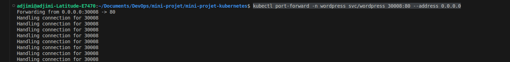

# Mini-projet Kubernetes: Déploiement de WordPress à l'aide de Manifests YAML.


## Objectif

Déployer une application WordPress et sa base de données MySQL dans un cluster Kubernetes, en assurant la persistance des données et l'accès via des services Kubernetes, tout en utilisant des manifests YAML.

## Étapes à suivre 

1- Création des manifests pour le namespace et un secret Kubernetes.

- Le namespace a pour rôle d'isoler et organiser toutes les ressources spécifiques à l'application WordPress et MySQL, permettant une gestion indépendante et sécurisée des composants de l'application dans le cluster Kubernetes.

Pour créer le namespace, exécutez la commande suivante :
```bash
kubectl apply -f app-namespace.yml
```


- Le manifest app-secret.yml définit un secret Kubernetes qui stocke les mots de passe pour la base de données WordPress et MySQL, ainsi que le mot de passe root de MySQL. Le rôle de ce secret est de sécuriser ces informations sensibles en les stockant séparément, non en texte clair, et en les rendant accessibles uniquement aux composants autorisés dans le namespace wordpress.

Pour créer le secret Kubernetes, exécutez la commande suivante : 

```bash
kubectl apply -f app-secret.yml 
```


2- Déployer MySQL et son service

Pour déployer MySQL et exposer son service, exécutez les commandes suivantes :
```bash
kubectl apply -f mysql-deployment.yml 
kubectl apply -f mysql-service.ymy
```


 3- Déployer les Persistent Volumes (PV) et Persistent Volume Claims (PVC)

 Les Persistent Volumes (PV) et Persistent Volume Claims (PVC) permettent la persistance des données dans le cluster Kubernetes.

Pour les déployer, exécutez les commandes suivantes :

 ```bash
kubectl apply -f pv-mysql.yml 
kubectl apply -f pvc-mysql.yml 
```


4- Déployer WordPress et son service

Pour déployer WordPress et son service, exécutez les commandes suivantes :

 ```bash
kubectl apply -f wordpress-deployment.yml 
kubectl apply -f wordpress-service.yml 
```


5- Accès à wordpress via le navigateur

Pour accéder à l'application WordPress via un navigateur, effectuez un port-forwarding en exécutant la commande suivante :

 ```bash
kubectl port-forward -n wordpress svc/wordpress 30008:80 --address 0.0.0.0
 ```

 

Ensuite, dans votre navigateur, tapez l'URL suivante : http://localhost:30008/ si Kubernetes est installé sur votre machine locale, comme dans ce projet.


## Conclusion 

Ce mini-projet Kubernetes nous a permis d'explorer et de comprendre le processus de déploiement d'une application complète (WordPress et MySQL) sur Kubernetes en utilisant des manifests YAML. Nous avons appris à gérer les déploiements, les services, ainsi que la persistance des données à l'aide de volumes dans Kubernetes.